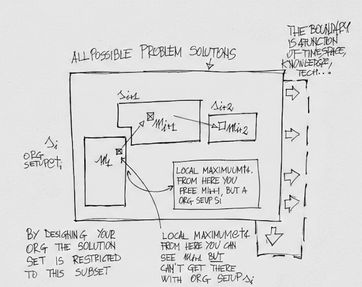

# How Do Committees Invent?
*The fundamental paper that gave birth to Conway's law*

## Introduction

In 1968, Melvin Conway published a paper with an observation so obvious in hindsight it's shocking it needed stating: organizations design systems that mirror their communication structures. Four teams? Four-component system. Teams don't talk? Neither do the components.

Conway's genius wasn't just identifying this pattern—now immortalized as "Conway's Law"—but recognizing its implications. The moment you organize a design team, you've constrained your solution space to only those designs that resemble your org chart. System optimization and organizational design become inseparable problems. This leads to an uncomfortable conclusion: constant reorganization might not be management theater—it might be the rational response to evolving requirements.

## TL;DR
- System design mirrors organizational structure (Conway's Law)
- Organizing a team constrains the solution space to the subset of designs that resemble the org chart
- Optimal solutions evolve with time, space, knowledge, and technology
- Therefore: perpetual reorganization is rational, not pathological
- Interfaces are required to deliver any system of consequence
- Interfaces are expensive—minimize them at design time

## Homomorphism

Any system of consequence is structured from smaller subsystems that are interconnected—a graph of components and their relationships. Homomorphism is the property of two graphs being structurally identical.

Conway's fundamental observation: the graph structure of a design organization and the graph structure of the system it designs are homomorphic (the same). Why? Because communication paths in the organization determine integration points in the system. Teams that must coordinate create interfaces between their components. Teams that don't talk build isolated subsystems.

Conway proves this rigorously in the paper (worth reading—it's elegant-don't make me compete with that, I will lose =)). What follows here are the practical implications you may not have heard beyond the familiar "systems mirror org charts" headline.

## Interfaces and the "Disintegration" of the Project

How do large systems disintegrate? (As in dis-integrate—don't think about deflagrations here, please.)

1. Irresistible temptation to assign too many people to the **design** effort
2. Communication structures disintegrate (connections scale as O(n²) with people)
3. Homomorphism ensures the solution mirrors the (now-disintegrated) organization

This is where Conway intersects beautifully with Dijkstra and Parnas. Conway's bottom line: interfaces are expensive and should only exist when forced by comprehension limits. He's clearly disaffected with "throwing more people at the problem" early in design, using the surprising and delightful term **overpopulate** to describe the phenomenon. His petition: designers should delegate (at design time) ONLY when system complexity approaches their individual comprehension limit.

This creates a balancing act between Dijkstra's hierarchical system design and Parnas's comprehensibility—minimize interfaces. Decompose before (and only when) your brain explodes.

### Why Did We Think Serverless Was a Good Idea?

The mid-2010s serverless craze (lambdas and friends) offers a perfect case study. Architecturally, it violated Conway's interface minimization principle: a hundred piecemeal lambdas composing business logic means a hundred interfaces to coordinate. Conway saw this coming fifty years ago.

The costs materialized predictably across the P&L. COGS exploded from compute waste—someone pays for CPU cycles spent waiting on service calls and cold starts, compressing operating margins. R&D velocity tanked as teams coordinated across interface boundaries rather than building features. Developer experience suffered from fragmented testing workflows and vendor lock-in. Teams burned cycles fragmenting their own cognitive models rather than solving customer problems.

I have the scars (and expense reports) to prove it. More lessons from the trenches will likely come in a follow-up piece.

## Designing an Organization Narrows the Solution Subset

A problem of any consequence has a large set of possible solutions. By designing an organization, we implicitly restrict ourselves to the subset of solutions that are homomorphic to that org structure. The architectural decisions are baked in before a single line of code is written.

As Conway puts it:

> The very act of organizing a design team means that certain design decisions have already been made, explicitly or otherwise.

## System Design as Constant Optimization

Conway makes a crucial observation about the temporal nature of design:

> [...] it is misleading to speak of **the** design for a specific job, unless this is understood in the context of space, time, knowledge, and technology.

There is no permanent "correct" architecture, or "correct" solution. Today's optimal solution becomes tomorrow's technical debt as requirements evolve, technology advances, and team knowledge deepens. This isn't a bug in our process—it's a fundamental constraint of operating in a changing world.

## Perpetual Reorganization Is Actually Rational

Every time I have worked in a large organization (or medium-sized, or anything undergoing M&A), we're in a constant state of reorganization. The six-month-old reorg barely settles before the next one begins.

Yes, there are externalities—PESTEL forces, management theater, empire building. But Conway's Law suggests something deeper: pursuing optimal system architectures *requires* organizational change. Consider this cycle:

1. Define problem
2. Organize design team (constraining solution space to homomorphic designs)
3. Find local maximum (cheapest? fastest? highest ARR?)
4. Realize the next optimization requires a system graph outside the current org's solution space
5. Reorganize to unlock that solution space
6. Return to step 1

The reorg isn't organizational dysfunction—it's the rational response to Conway's constraint. If system design and org structure are inseparable, then optimizing one requires changing the other. The companies that accept this reality and reorganize deliberately outmaneuver those treating org structure as permanent.

Conway didn't just observe that committees shape systems. He revealed that evolution of one demands evolution of the other. Fifty-eight years later, we're still learning that lesson. 